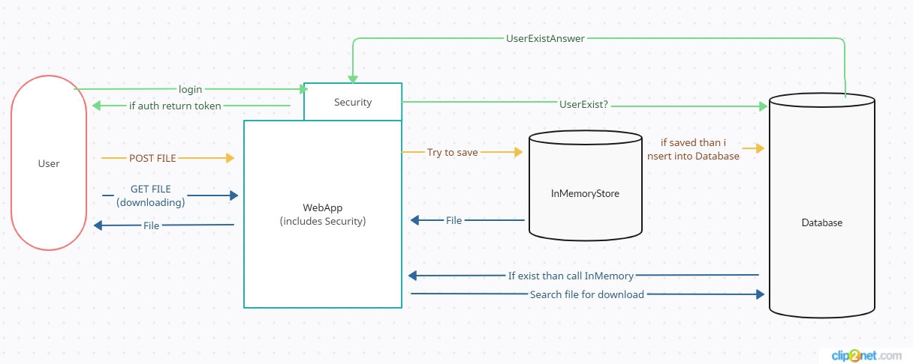

## Облачное хранилище
___
Приложение - REST сервис, для хранения и скачивания файлов.
В данной реализации харнилище реализованно во внутренней памяти, в базе данных хранятся данные
о файлах, но не сами файлы.

Для аутентификации используется JWT токен
Пользователь по умолчанию:
u@mail.ru
pass

___
### Cхема приложения

